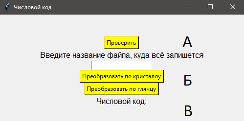
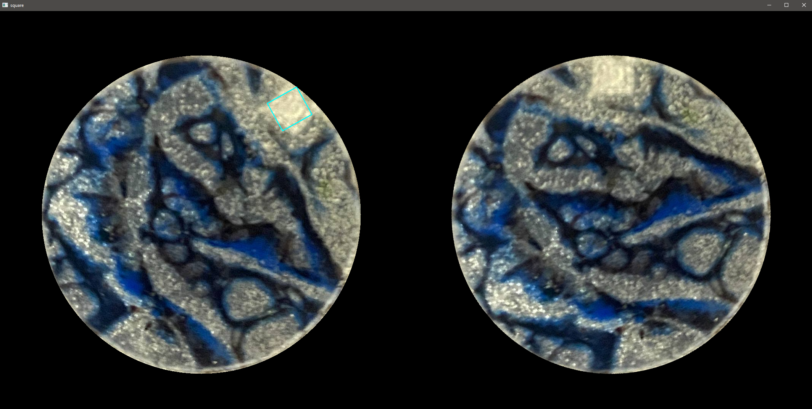
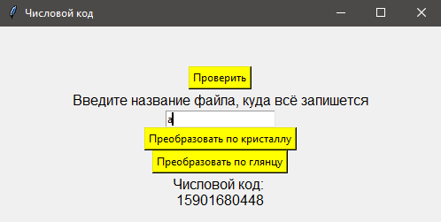

**Программа числовой код кристалла**

Кнопка (А) служит для проверки на наличие метки у кристалла.

Поле (Б) куда нужно вписать название файла, в который в дальнейшем запишется числовой код изображения. Если файла с вписанным названием не существует, тогда программа самостоятельно создаст файл с расширением .txt в ту же директиву, где находится программа.

После нажатия на кнопку преобразовать программа потребует выбрать изображение, которое хотите использовать.

После выбора изображения программа выдаст 2 фотографии: одна с выделенной областью, вторая с поворотом на 12 часов

А также в поле (В) будет выведен числовой код повернутого изображения.

Таблица функций:

| Функция               | Описание                                                                                                                                                                                                                                                                                                                          |
|-----------------------|-----------------------------------------------------------------------------------------------------------------------------------------------------------------------------------------------------------------------------------------------------------------------------------------------------------------------------------|
| generate_matrix_id    | Генерирует числовой код (хеш) изображения на основе его матрицы пикселей.                                                                                                                                                                                                                                                         |
| circle_mask           | Создает маску круга на изображении с заданным центром и радиусом.                                                                                                                                                                                                                                                                 |
| check_black_pixels    | Проверяет, содержит ли изображение более 60% черных пикселей.                                                                                                                                                                                                                                                                     |
| variance_of_laplacian | Рассчитывает вариацию лапласиана изображения.                                                                                                                                                                                                                                                                                     |
| rotate                | Поворачивает изображение вокруг его центра на заданный угол.                                                                                                                                                                                                                                                                      |
| show_image            | Отображает изображение в графическом интерфейсе.                                                                                                                                                                                                                                                                                  |
| update_image_label    | Обновляет размеры и отображение изображения в графическом интерфейсе, чтобы оно соответствовало размеру окна.                                                                                                                                                                                                                     |
| on_window_resize      | Обработчик события изменения размера окна. Вызывает функцию update_image_label для обновления размеров отображаемого изображения при изменении размера окна.                                                                                                                                                                      |
| remove_background      | Удаляет фон из изображения и возвращает результат и координаты центра.                                                                                                                                                                      |
| get_glossy            | Обрабатывает изображение с помощью фильтрации по глянцу и возвращает маскированное изображение и центр окружности.                                                                                                                                                                     |
| try_filter            | Применяет фильтры и анализирует изображение с целью поиска метки. Проверяет условия наличия черных пикселей и нахождения основной окружности. Если метка найдена, отображает изображение с выделенной меткой. Если используется режим проверки (check=True), выводит сообщение о нахождении метки. Возвращает числовой код метки. |
| btn_click_crystal             | Обработчик события нажатия кнопки для обработки изображения по кристаллу.                                                                                                                                                                      |
| btn_check             | Обработчик нажатия кнопки "Проверить". Получает выбранный файл, обрабатывает его и анализирует на наличие метки. Если метка найдена, выводит сообщение об успешной находке.                                                                                                                                                       |

# Пошаговое описание алгоритма:

1. Изображение будет передано в функцию `get_glossy()` / `remove_background()`, которая выполнит следующие действия:
   - Преобразование изображения в цветовую модель HSV.
   - Применение цветового фильтра к изображению, чтобы выделить глянцевую метку / метку кристалла.
   - Поиск контуров на изображении.
   - Определение основной окружности, ограничивающей глянцевую метку.
   - Возвращение маскированного изображения метки и координат центра окружности.

2. Если маскированное изображение метки и координаты центра окружности были успешно получены, программа вызовет функцию `try_filter()` с полученными параметрами.

3. Функция `try_filter()` выполнит следующие действия:
   - Проверит наличие черных пикселей на изображении и уровень размытости.
   - Если проверка не пройдена, будет показано сообщение об ошибке, указывающее, что фото не подходит.
   - Иначе, изображение будет размыто и применен цветовой фильтр с изменяемым верхним порогом значений HSV.
   - Далее будут выполнены следующие шаги в цикле:
     - Поиск контуров на фильтрованном изображении.
     - Вычисление площади контуров и фильтрация по заданным условиям.
     - Определение ограничивающего прямоугольника минимальной площади для каждого контура.
     - Проверка формы прямоугольника и его положения в пределах изображения.
     - Проверка, что хотя бы один пиксель внутри прямоугольника имеет значение 0 (черный пиксель).
     - Если все условия выполнены, будет выполнено следующее:
       - Вычисление центра прямоугольника.
       - Копирование изображения и отрисовка ограничивающего прямоугольника.
       - Поворот изображения относительно центральной окружности.
       - Объединение изображений для отображения.
       - Генерация числового кода для повернутого изображения.
       - Вывод числового кода на экран.
       - Возвращение числового кода.

4. Если метка была найдена и успешно обработана, будет сгенерирован числовой код, который будет записан в файл с указанным названием в поле ввода.